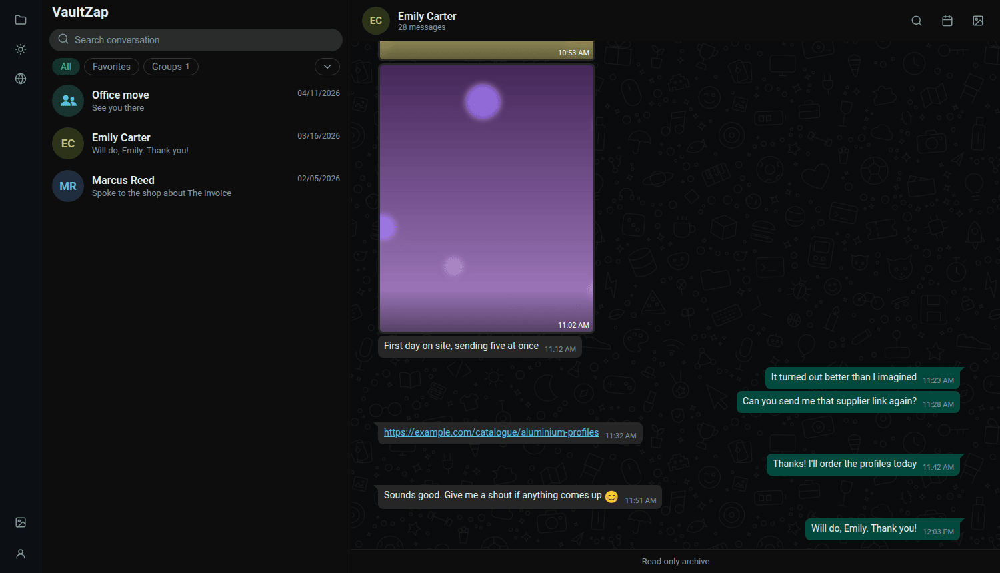
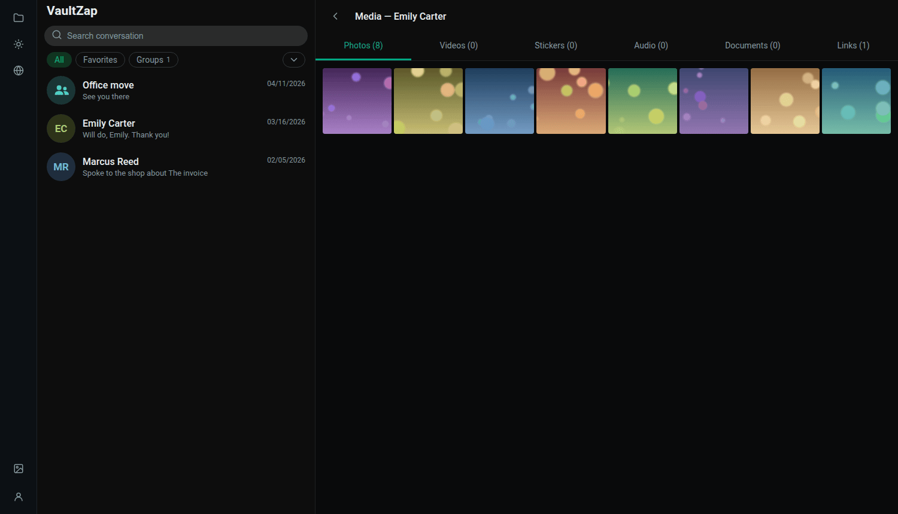
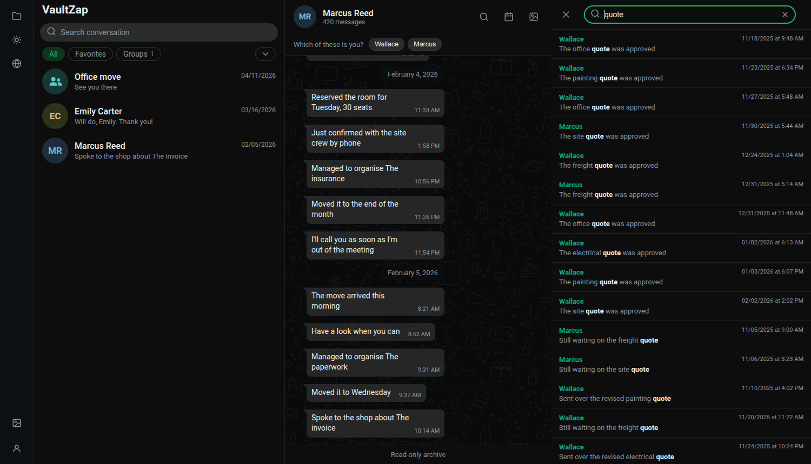
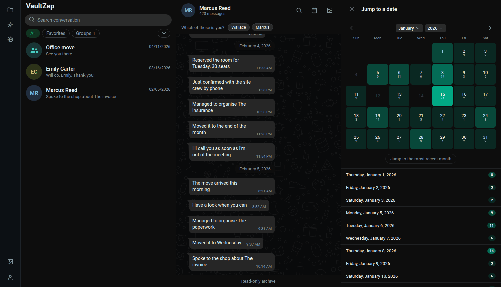

  

<h1 align="center">VaultZap</h1>

  <strong>Local, browsable archive of exported WhatsApp conversations.</strong>

  One binary, one SQLite file, no cloud — it reads like WhatsApp Web.

  <a href="docs/en/usage.md">Usage</a> ·
  <a href="docs/en/docker.md">Docker</a> ·
  <a href="docs/en/podman.md">Podman</a> ·
  <a href="docs/en/quadlet.md">Quadlet</a> ·
  <a href="docs/en/configuration.md">Configuration</a> ·
  <a href="docs/en/troubleshooting.md">Troubleshooting</a> ·
  <a href="README.md">🇧🇷 Português</a>

  
  
  
  
  
  
  
  

> *"Who controls the past controls the future; who controls the present controls the
> past."*
>
> — George Orwell, *1984*

Your archive is yours. And with it, your past.

<table>
  <tr>
    <td width="50%"></td>
    <td width="50%"></td>
  </tr>
  <tr>
    <td align="center"><b>Conversation</b> — bubbles on both sides, inline media, date dividers</td>
    <td align="center"><b>Gallery</b> — photos, videos, stickers, audio, documents and links</td>
  </tr>
  <tr>
    <td width="50%"></td>
    <td width="50%"></td>
  </tr>
  <tr>
    <td align="center"><b>Search</b> — full text, jumping to the message in context</td>
    <td align="center"><b>Calendar</b> — the stronger the green, the more was said that day</td>
  </tr>
</table>

<em>Every conversation above is fictional, generated for the
screenshots — no real data goes into this repository.</em>

You export a conversation from the WhatsApp app and drop the file into a watched folder.
There's no upload screen, no account, no cloud.

| | |
|---|---|
| 🗂️ **Reads the export as it comes** | a loose `.txt`, a `.zip` with media, or the already-extracted folder — Android and iPhone, 8 export languages |
| 💬 **Just like WhatsApp Web** | bubbles on both sides, grouping, date dividers, stickers without a bubble, voice player with a real waveform |
| 🔍 **Accent-insensitive search** | FTS5 in the database: `nao` finds "não", and the hit jumps to the message in context |
| 🖼️ **Gallery by type** | photos, videos, stickers, audio, documents and links, in tabs |
| 📅 **Date-jump calendar** | one month at a time, with each day's intensity |
| ⭐ **Star and pin** | marked messages, with a pinned strip under the header |
| 📤 **Export back out** | TXT, Markdown, HTML, print and Typst — in whichever language is selected |
| 🌍 **8 interface languages** | pt-BR, pt, en, es, it, fr, de, nl |
| 🔒 **Nothing leaves your machine** | no telemetry, no CDN, no external request |

## Why it exists

An exported WhatsApp conversation is one enormous `.txt` — readable by a program, unreadable
by a person. Nobody can reread three years of messages in a wall of text, find the photo
someone sent, or jump to the day something was agreed on. That's why a WhatsApp backup is,
in practice, a file nobody ever opens: it exists, but it isn't useful.

VaultZap solves both halves of that problem at once:

- **A backup that's actually yours.** The archive is a SQLite file and a media folder, on
  your disk, on your machine. No cloud, no account, no telemetry, not a single request
  leaving for the internet. Copying the folder is the backup; opening the `.db` with
  `sqlite3` is your guarantee that the data is still yours ten years from now, with or
  without this program.
- **The same view as WhatsApp Web.** Chat list, bubbles on both sides, date dividers, inline
  media, a gallery by type, accent-insensitive search, a calendar to jump to a date. If
  you've used WhatsApp Web, there's nothing new to learn.

This matters more than it sounds like for people who *need* to reread a conversation: the
court case that hinges on something agreed over messages, the estate of someone who died,
the report that only exists in the history, the memory of a person who isn't here anymore.
In those moments the history can't depend on an active account, on a phone that still works,
or on a company choosing to keep offering the service. It has to be with you.

Nothing is sent back, nothing is published, nothing is analyzed. VaultZap is **read-only**:
it never connects to your account, never sends messages, and knows no WhatsApp API at all —
it just reads the file you exported yourself.

## Requirements

Runs on just about anything. The numbers below are measured, not estimated:

| | |
|---|---|
| **CPU** | x86-64 or ARM64 |
| **RAM** | ~25 MB |
| **Disk** | ~18 MB image + ~1.3 KB per message + the size of your media |
| **Browser** | Chrome/Edge 111+, Firefox 121+, Safari 16.4+ |

Media dominates disk usage: the database for a 36,000-message conversation stays under
50 MB, but its attachments can run past 1 GB. With `VAULTZAP_AFTER_IMPORT=move` (the
default), budget space for the archive **and** for the original exports, which are kept.

To build from source: Go 1.25+.

## Running it

| | |
|---|---|
| [**Docker**](docs/en/docker.md) | The most common route, with `docker compose` or `docker run`. Includes the rootless variant. |
| [**Podman**](docs/en/podman.md) | The Docker equivalent, with the rootless and SELinux differences. |
| [**Quadlet**](docs/en/quadlet.md) | Runs as a systemd `--user` service, starting with your session. |
| [**Development**](docs/en/development.md) | `make dev`, tests, and running the binary directly, without a container. |
| [**Configuration**](docs/en/configuration.md) | Every `VAULTZAP_*` variable and how to turn the password on. |

## Using VaultZap

| | |
|---|---|
| [**Usage**](docs/en/usage.md) | The interface guide: importing, search, calendar, gallery, marking messages, merging duplicated conversations, exporting, backup. |
| [**Troubleshooting**](docs/en/troubleshooting.md) | When something goes wrong: the file didn't import, every bubble is on the left, the container won't start. |

## Exporting a WhatsApp conversation

<b>Android</b> — open the conversation → ⋮ → More → Export chat

1. Open the conversation you want to archive.
2. Tap **⋮** (top right) → **More** → **Export chat**.
3. Pick **Include media** to bring photos, videos and audio along, or **Without media** for
   text only (much smaller — and you can export with media later, VaultZap merges the two).
4. Share the file into the watched folder: email it to yourself, Drive, Syncthing, KDE
   Connect, a USB cable. Any route works, as long as the file lands there.

<b>iPhone</b> — open the conversation → contact name → Export Chat

1. Open the conversation and tap the **contact or group name** at the top.
2. Scroll to the bottom and tap **Export Chat**.
3. Pick **Attach Media** or **Without Media**.
4. Send it to the watched folder (Files, AirDrop, email, Drive). The iPhone produces a `.zip`
   with `_chat.txt` inside — drop the whole `.zip` in, no need to unpack it.

Drop the resulting `.txt` or `.zip` into the watched folder (`VAULTZAP_INBOX`). The scan runs
on app startup and when you click **"scan now"** on the `/imports` page — there's no
periodic scan. With the default `move` policy, the imported file leaves the inbox for
`VAULTZAP_IMPORTED_DIR/YYYY-MM/` (default `<inbox>/.imported`), so the inbox always stays
clean, showing only what's still left to import.

## Trademarks

VaultZap is not affiliated with, associated with, authorised or sponsored by Meta
Platforms, Inc. WhatsApp is a trademark of Meta Platforms, Inc.; the name is used here
only to describe the file format this program reads.

## License

[GNU AGPL-3.0](LICENSE). Use it, study it, modify it and redistribute it freely — the one
condition is that **a modified version offered over a network has to offer its source too**.
It is the license that says, in legal terms, what the epigraph above says: the record does
not become the property of whoever hosts it.

Running VaultZap unmodified obliges you to nothing, and the archive you keep in it is
entirely yours — the license covers the program, never your data.

The binary embeds two third-party libraries, both permissively and compatibly licensed:
[htmx](https://htmx.org) (BSD 2-Clause) and [Alpine.js](https://alpinejs.dev) (MIT), vendored
under `internal/web/static/vendor/`. The SQLite driver
([modernc.org/sqlite](https://modernc.org/sqlite), BSD 3-Clause) is the only Go dependency.
