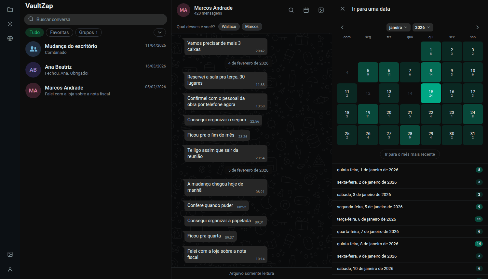

  

<h1 align="center">VaultZap</h1>

  <strong>Arquivo local e navegável de conversas exportadas do WhatsApp.</strong>

  Um binário, um arquivo SQLite, zero nuvem — a leitura é igual à do WhatsApp Web.

  <a href="docs/usage.md">Uso</a> ·
  <a href="docs/docker.md">Docker</a> ·
  <a href="docs/podman.md">Podman</a> ·
  <a href="docs/quadlet.md">Quadlet</a> ·
  <a href="docs/configuration.md">Configuração</a> ·
  <a href="docs/troubleshooting.md">Problemas</a> ·
  <a href="README.en.md">🇺🇸 English</a>

  
  
  
  
  
  
  
  

> *"Quem controla o passado controla o futuro; quem controla o presente controla o
> passado."*
>
> — George Orwell, *1984*

O seu acervo é seu. E, com ele, o seu passado.

<table>
  <tr>
    <td width="50%"></td>
    <td width="50%"></td>
  </tr>
  <tr>
    <td align="center"><b>Conversa</b> — bolhas dos dois lados, mídia inline, divisores de data</td>
    <td align="center"><b>Galeria</b> — fotos, vídeos, figurinhas, áudios, documentos e links</td>
  </tr>
  <tr>
    <td width="50%"></td>
    <td width="50%"></td>
  </tr>
  <tr>
    <td align="center"><b>Busca</b> — sem acento: <code>orcamento</code> acha <i>orçamento</i></td>
    <td align="center"><b>Calendário</b> — quanto mais forte o verde, mais conversa naquele dia</td>
  </tr>
</table>

<em>Todas as conversas acima são fictícias, geradas para as capturas —
nenhum dado real entra neste repositório.</em>

Você exporta uma conversa no app do WhatsApp e solta o arquivo numa pasta observada. Não há
tela de upload, não há conta, não há nuvem.

| | |
|---|---|
| 🗂️ **Lê o export como ele vem** | `.txt` solto, `.zip` com mídia ou a pasta já extraída — Android e iPhone, 8 idiomas de export |
| 💬 **Igual ao WhatsApp Web** | bolhas dos dois lados, agrupamento, divisores de data, figurinha sem bolha, player de voz com forma de onda |
| 🔍 **Busca sem acento** | FTS5 no banco: `nao` acha "não", e o resultado salta para a mensagem no contexto |
| 🖼️ **Galeria por tipo** | fotos, vídeos, figurinhas, áudios, documentos e links, em abas |
| 📅 **Calendário de saltos** | um mês por vez, com a intensidade de cada dia |
| ⭐ **Favoritar e fixar** | mensagens marcadas, com faixa de fixadas sob o cabeçalho |
| 📤 **Exportar de volta** | TXT, Markdown, HTML, impressão e Typst — no idioma que estiver selecionado |
| 🌍 **8 idiomas de interface** | pt-BR, pt, en, es, it, fr, de, nl |
| 🔒 **Nada sai da sua máquina** | zero telemetria, zero CDN, zero requisição externa |

## Por que existe

Uma conversa exportada do WhatsApp é um `.txt` gigante — legível por um programa, ilegível
por uma pessoa. Ninguém consegue reler três anos de mensagens numa parede de texto, achar a
foto que alguém mandou, ou saltar para o dia em que uma coisa foi combinada. É por isso que
o backup do WhatsApp, na prática, é um arquivo que ninguém abre: ele existe, mas não serve.

O VaultZap resolve as duas metades desse problema ao mesmo tempo:

- **Backup de verdade, seu.** O acervo é um arquivo SQLite e uma pasta de mídia, no seu
  disco, na sua máquina. Sem nuvem, sem conta, sem telemetria, sem uma única requisição
  saindo para a internet. Copiar a pasta é o backup; abrir o `.db` com `sqlite3` é a garantia
  de que o dado é seu mesmo daqui a dez anos, com ou sem este programa.
- **Visualização igual à do WhatsApp Web.** Lista de conversas, bolhas dos dois lados,
  divisores de data, mídia inline, galeria por tipo, busca com e sem acento, calendário para
  saltar a uma data. Quem já usou o WhatsApp Web não precisa aprender nada.

Isso importa mais do que parece para quem **precisa** reler uma conversa: o processo
judicial que depende de um combinado por mensagem, o inventário de uma pessoa que morreu, a
denúncia que só existe no histórico, a memória de alguém que não está mais aqui. Nesses
momentos o histórico não pode depender de uma conta ativa, de um aparelho que funcione, nem
de uma empresa continuar oferecendo o serviço. Ele precisa estar com você.

Nada é enviado de volta, nada é publicado, nada é analisado. O VaultZap é **somente
leitura**: ele não conecta na sua conta, não envia mensagens e não conhece nenhuma API do
WhatsApp — só lê o arquivo que você mesmo exportou.

## Requisitos

Roda em praticamente qualquer coisa. Os números abaixo são medidos, não estimados:

| | |
|---|---|
| **CPU** | x86-64 ou ARM64 |
| **RAM** | ~25 MB |
| **Disco** | ~18 MB de imagem + ~1,3 KB por mensagem + o tamanho da sua mídia |
| **Navegador** | Chrome/Edge 111+, Firefox 121+, Safari 16.4+ |

A mídia domina o disco: o banco de uma conversa de 36 mil mensagens não chega a 50 MB, mas
os anexos dela podem passar de 1 GB. Se usar `VAULTZAP_AFTER_IMPORT=move` (o padrão), conte
com espaço para o acervo **e** para os exports originais, que são preservados.

Para compilar do código: Go 1.25+.

## Como rodar

| | |
|---|---|
| [**Docker**](docs/docker.md) | O caminho mais usado, com `docker compose` ou `docker run`. Inclui a variante rootless. |
| [**Podman**](docs/podman.md) | Equivalente ao Docker, com as diferenças de rootless e SELinux. |
| [**Quadlet**](docs/quadlet.md) | Roda como serviço do systemd `--user`, iniciando junto com a sessão. |
| [**Desenvolvimento**](docs/development.md) | `make dev`, testes, e como rodar o binário direto, sem container. |
| [**Configuração**](docs/configuration.md) | Todas as variáveis `VAULTZAP_*` e como ligar a senha. |

## Usando o VaultZap

| | |
|---|---|
| [**Uso**](docs/usage.md) | O guia da interface: importar, buscar, calendário, galeria, marcar mensagens, mesclar conversas duplicadas, exportar, backup. |
| [**Problemas**](docs/troubleshooting.md) | Quando algo dá errado: o arquivo não importou, as bolhas estão todas à esquerda, o container não sobe. |

## Exportar uma conversa do WhatsApp

<b>Android</b> — abra a conversa → ⋮ → Mais → Exportar conversa

1. Abra a conversa que você quer arquivar.
2. Toque em **⋮** (canto superior direito) → **Mais** → **Exportar conversa**.
3. Escolha **Incluir mídia** para levar fotos, vídeos e áudios, ou **Sem mídia** para só o
   texto (bem menor, e você pode exportar com mídia depois — o VaultZap junta os dois).
4. Compartilhe o arquivo para a pasta observada: e-mail para você mesmo, Drive, Syncthing,
   KDE Connect, cabo USB. Qualquer caminho serve, contanto que o arquivo chegue lá.

<b>iPhone</b> — abra a conversa → nome do contato → Exportar conversa

1. Abra a conversa e toque no **nome do contato ou do grupo**, no topo.
2. Role até o fim e toque em **Exportar conversa**.
3. Escolha **Anexar mídia** ou **Sem mídia**.
4. Envie para a pasta observada (Arquivos, AirDrop, e-mail, Drive). O iPhone gera um `.zip`
   com o `_chat.txt` dentro — solte o `.zip` inteiro, sem descompactar.

Solte o `.txt` ou `.zip` resultante na pasta observada (`VAULTZAP_INBOX`). A varredura roda
no startup do app e quando você clica em **"varrer agora"** na página `/imports` — não há
varredura periódica. Com a política padrão `move`, o arquivo importado sai da inbox para
`VAULTZAP_IMPORTED_DIR/AAAA-MM/` (default `<inbox>/.imported`), então a inbox fica sempre
limpa, mostrando só o que falta importar.

## Marcas

VaultZap não é afiliado, associado, autorizado ou patrocinado pela Meta Platforms, Inc.
WhatsApp é marca registrada da Meta Platforms, Inc.; o nome é usado aqui apenas para
descrever o formato de arquivo que este programa lê.

## Licença

[GNU AGPL-3.0](LICENSE). Use, estude, modifique e redistribua à vontade — a única
contrapartida é que **uma versão modificada oferecida pela rede tem que oferecer o código
dela também**. É a licença que diz, em termos jurídicos, a mesma coisa que a epígrafe lá em
cima: o registro não vira propriedade de quem o hospeda.

Rodar o VaultZap sem modificar não te obriga a nada, e o acervo que você guarda nele é
inteiramente seu — a licença cobre o programa, nunca os seus dados.

O binário embute duas bibliotecas de terceiros, ambas com licença permissiva e compatível:
[htmx](https://htmx.org) (BSD 2-Clause) e [Alpine.js](https://alpinejs.dev) (MIT),
vendorizadas em `internal/web/static/vendor/`. O driver SQLite
([modernc.org/sqlite](https://modernc.org/sqlite), BSD 3-Clause) é a única dependência Go.
