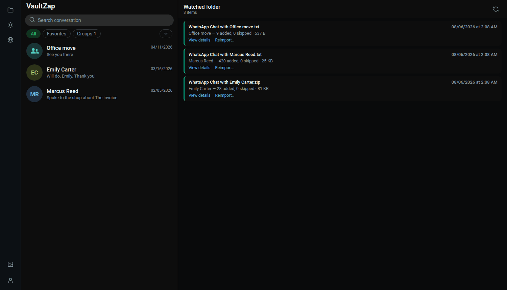
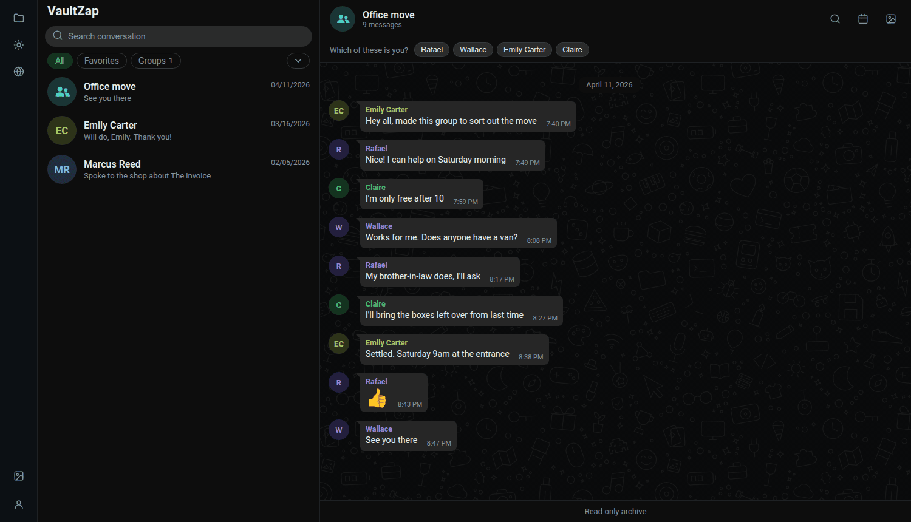
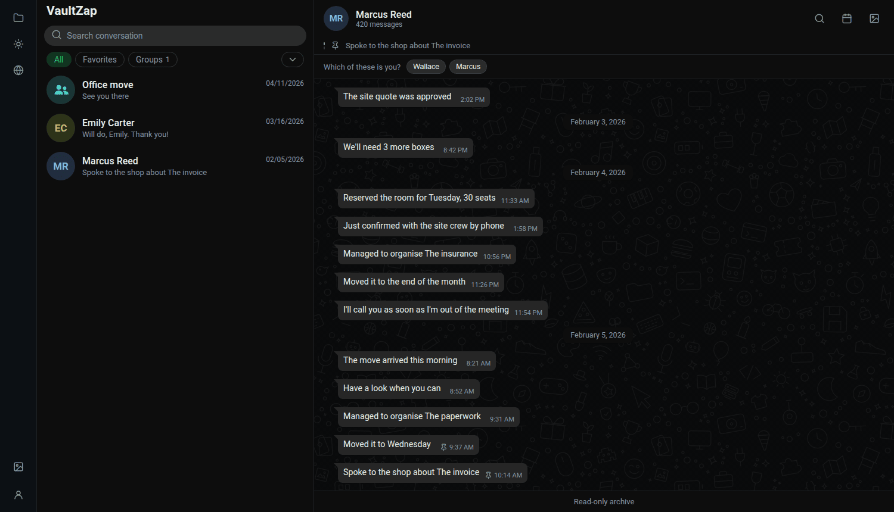
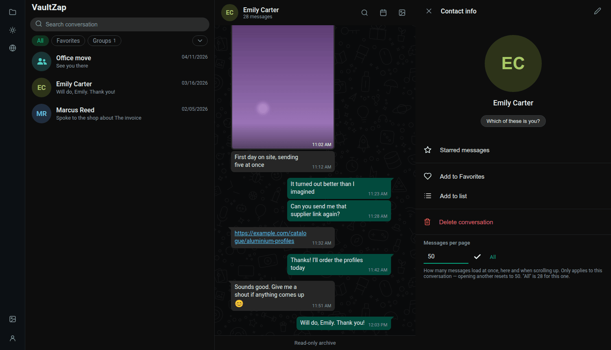
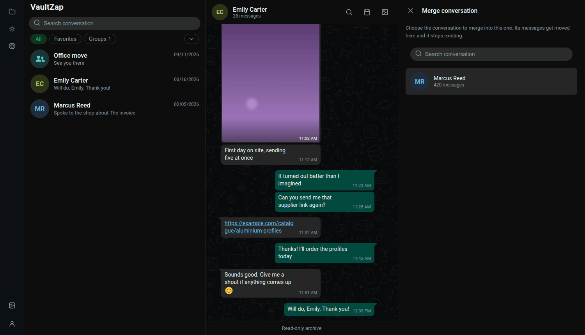

[← Back to the README](../../README.en.md) · [Configuration](configuration.md) · [Development](development.md) · [Docker](docker.md) · [Podman](podman.md) · [Quadlet](quadlet.md) · [Usage](usage.md) · [Troubleshooting](troubleshooting.md)

# Usage

What you can do once the app is up. None of it is mandatory: dropping the export into the
inbox and opening the conversation is already the whole flow — the rest exists for when the
archive grows.

**VaultZap is read-only.** There's no message box: in its place, a bar reading "Read-only
archive". It never connects to your account, never sends a message, and knows no WhatsApp API
at all.

## Importing a conversation

Drop the exported `.txt` or `.zip` into the watched folder (`VAULTZAP_INBOX`). Accepted:

- `WhatsApp Chat with Jane.txt` — a conversation without media;
- `WhatsApp Chat with Jane.zip` — the export with media, exactly as WhatsApp generates it;
- a subfolder holding the `.txt` plus loose media files (this is also the
  [chatvault](https://github.com/vitormarcal/chatvault) layout, which imports directly,
  profile picture included).

**Scanning isn't periodic.** It runs when the app starts and when you click **"scan now"** on
the imports page (folder icon in the sidebar). That's deliberate: inotify doesn't work on
network shares (CIFS/SMB, NFS), which is exactly the case for anyone syncing the inbox from
their phone over Syncthing or Samba.

The button takes a few seconds, and that's normal: the app reads the folder twice, with a
gap, so it never touches a file that's still being copied. An 800 MB `.zip` caught mid-copy
would be a broken import.

Once imported, the file **leaves the inbox** for `.imported/YYYY-MM/` (the default `move`
policy — nothing is deleted, it just moves). That way the inbox always shows only what's
still left to import. To change that, see `VAULTZAP_AFTER_IMPORT` in
[Configuration](configuration.md).

### Re-exporting the same conversation later

This is the common case: a few months from now you export the same conversation again and
drop it in. **Only the new messages are added** — repeats are skipped, not duplicated. Same
for media, deduplicated by content.

If you exported without media first and with media later, import both: messages don't
duplicate and the photos show up on the messages that were already there.

### The imports page

The folder icon in the sidebar opens the history: every file seen, how many messages were
added, how many were skipped, and the parser's warnings. A colored dot appears in the sidebar
when something failed or is still being processed.

  

- **"Skipped" doesn't mean lost** — those are messages already in the archive.
- **Warnings** name the exact line of the export the parser didn't understand. A malformed
  file never brings the import down: the line becomes a system message holding the raw text,
  and everything else goes in normally. If you'd rather fix the `.txt` and import again, use
  **"Reimport…"** on the item itself.

### Coherence check

Every imported file goes through triage: VaultZap compares what arrived against what WhatsApp
normally writes and lists what stands out, in the same detail panel.

**First, what it is not.** A WhatsApp export carries no signature, no MAC, no cryptographic
tie to the device — it is plain text, and a text editor changes a line without leaving a
trace. **No software can attest that an export is authentic**, and neither does this one. No
alerts proves nothing; what the check catches is careless editing.

What it looks at:

| signal | what it means |
|---|---|
| **Invisible marks** | WhatsApp writes invisible characters (`U+200E` and relatives) before attachment and notice lines. Editing in a text editor does not reproduce them. It only speaks when the file shows it uses them: an Android export has none at all, and that is normal. |
| **Chronological order** | a message dated well before the one above it. Inversions of seconds are normal — WhatsApp lists messages in display order, and one that arrived late keeps its own clock — so only differences beyond five minutes count. |
| **Media naming** | photos, video, audio and stickers get names from WhatsApp itself (`IMG-20260726-WA0001.jpg`). Documents and contact cards keep their original name and are not checked. |
| **Date inside the media name** | the name carries the day the file was created. A day other than the message's says one of the two was touched. |
| **Missing media** | files cited in the text that did not come in the `.zip`, **while others did**. An export made "without media" cites everything and delivers nothing — that is normal and is not flagged. |

Each finding points at the line or message where it starts, so you can open the file and look.

Two things help more than any automatic check:

- **The file's hash is already recorded.** VaultZap stores the `sha256` of everything it
  imports, which pins the bytes from that moment on: if the file changes later, the hash says so.
- **Compare with the other side's export.** The same conversation exported from the other
  person's phone is the strongest check available short of forensics. A divergence between
  the two is an alteration — or a deletion — in one of them.

If the conversation is going to be used as evidence, the path is a different one: a notarial
record (a notary attests to what they see on the device) or forensic extraction. Worth
knowing that Meta cannot provide message content even under court order — messages are
end-to-end encrypted; it only holds metadata.

## Who "you" are

In a 1:1 conversation the app figures it out on its own: the filename is the other person,
so the other sender is you — and your messages go to the right, in green. When it can't tell
(a group, a renamed file, a different nickname), a bar appears at the top of the conversation
asking **"which of these is you?"**. Until you answer, every bubble stays on the left; the
app won't guess.

  

The choice is per conversation and can be redone any time from the **Contact info** panel.
For a global default, use `VAULTZAP_ME`.

## Reading a conversation

The reading experience mirrors WhatsApp Web on purpose: bubbles on both sides, consecutive
messages from the same sender grouped, date dividers ("TODAY", "YESTERDAY", "Saturday",
"July 26, 2026"), inline media, stickers without a bubble, audio with a player, documents as
cards.

  

There are no ✓✓: the export carries no delivery or read status, and VaultZap doesn't invent
data the file doesn't have.

- A conversation opens at the end and **loads 50 messages at a time** as you scroll up.
- To load more at once, use the **"Load messages"** field in the Contact info panel — or the
  **"All"** button, which pulls the entire conversation. On a 36,000-message chat that takes
  a few seconds, and it's worth it when you want your browser's Ctrl+F. The value applies
  only to the open conversation; opening another goes back to 50.
- **One player at a time**: playing an audio or video pauses whatever was playing.

## Finding a message

Three routes, all landing in the same place — the conversation positioned on the message,
highlighted by a green band:

  

**Global search** — the field at the top of the sidebar filters the conversation list.

**In-conversation search** — the magnifier in the header opens that conversation's search
panel. Accents are ignored: `nao` finds "não", `voce` finds "você".

**Calendar** — the calendar icon opens one month at a time, with each day's message count
(stronger green = more conversation) and a list of the days that have messages. Clicking a day jumps
to its first message. The month and year pickers jump straight to a distant period; empty
months in the middle stay navigable, which is exactly what the calendar is there to show.

## Gallery

The gallery icon opens the conversation's media in six tabs: **photos**, **videos**,
**stickers**, **audio**, **documents** and **links** (that last one scans message text, not
attachments). Clicking a photo or video opens it full screen.

  

An attachment named in the `.txt` but missing from the `.zip` — common when you export
"without media" — shows up as a placeholder, never as an error.

## Organizing the conversation list

Hover a conversation and use the menu (⌄):

| action | what it does |
|---|---|
| **Pin** | Sticks it to the top of the list. Max **3**; the fourth is refused with a notice. |
| **Favorite** | Feeds the "Favorites" chip above the list. |
| **Archive** | Takes it off the main list and into "Archived". |
| **Add to a list** | Your own lists (Family, Work…). A conversation can be in several. |
| **Merge conversation** | Folds another conversation into this one. See below. |
| **Update conversation** | Imports a file from the inbox into *this* conversation. See below. |
| **Export conversation** | Five formats. See below. |
| **Delete conversation** | See below. |

The **chips** above the list (`All`, `Favorites`, `Groups`, one per list, and `+` to create
one) filter it; whatever doesn't fit on the line moves into the `⌄` menu beside them.

Archiving and favoriting are interface state only: no message, attachment or file is touched.
Deleting a list deletes no conversation.

**There's no "Unread"** — the export carries no read status, and VaultZap doesn't invent it.

## Marking messages

Hover a message and a `⌄` appears in its corner.

  

- **Favorite** files the message under **Favorite messages** in the Contact info panel — the
  list of everything you marked, each jumping back to the message in context.
- **Pin** puts the message on a band under the conversation header. Max **4**; pinning a
  fifth asks before replacing the oldest. Clicking the band jumps to the pinned message and
  advances to the next, so repeated clicks walk through all of them.

Unlike WhatsApp, pinning here **doesn't expire** — there's no 24h/7-day/30-day choice.

## Contact info

Click the conversation's name in the header. This panel is where personalization lives:

  

- **Rename the conversation** and note a **phone number**. When the contact wasn't saved on
  the phone that exported, WhatsApp names the file with the number — in that case the phone
  is already filled in and all that's left is giving it a human name.
- **Profile picture**: pick an image and crop it in the circle, with zoom. It's the **only**
  thing you ever upload to VaultZap, and it's your personalization, not export data —
  WhatsApp doesn't export profile pictures. Without one, the avatar is initials in a color
  derived from the name.
- **Rename a participant** (in groups): exports identify plenty of people by phone number or
  "~nickname". Here you give them a display name, and the color and initials follow it. The
  export's original data is never altered; the name applies to this group only.
- **Redoing "which of these is you"**, **favorite messages** and the **page size** live here
  too.

## Duplicated or incomplete conversation

The app matches an export to a conversation by **filename**. If the contact changed numbers,
if you renamed the conversation here, or if the export came from chatvault (a UUID-named
folder), the new file becomes a second conversation instead of completing the existing one.
Two remedies:

  

**Merge conversation** — open the menu on the conversation that should **stay** and pick, by
name, which other one to absorb. Repeated messages don't duplicate; the survivor inherits
whatever only the other had (media, picture, phone, the "you"). It only merges conversations
of the same kind — a group never matches a 1:1. **It can't be undone**, so the app confirms,
naming both sides.

**Update conversation** — opens the inbox and imports the file you pick into *this*
conversation, ignoring its name. It's the preventive route: drop the file in with the app
open and use the menu, rather than letting the scan create a separate conversation.

## Exporting back out

Conversation menu → **Export conversation**, in five formats:

| format | what it's for |
|---|---|
| **TXT** | Plain text, close to WhatsApp's own export. |
| **Markdown** | For version control, pasting into an editor, or further processing. |
| **HTML** | A single page with bubbles on both sides, opens in any browser. |
| **Print** | The same, with a paper stylesheet — open it and use your browser's "Save as PDF". |
| **Typst** | A `.typ` source for anyone who wants real typography and has the compiler. Comes out as one continuous page, no page breaks. |

**VaultZap generates no PDF** and invokes no compiler: it's your browser (or your Typst) that
finishes the file. No external binary, no service.

**Media doesn't go into the document**: a message with an attachment shows as `[photo]`,
`[audio]`, and so on. The files stay inside VaultZap.

**The document comes out in whichever language is selected** in the interface: date
dividers, date and time format, attachment labels and the footer. Message text is never
translated — that's what the person wrote.

## Deleting a conversation

Conversation menu → **Delete**. It removes the messages, the attachments and **its media
files from disk**. What it never touches is the original export: if it's still in the inbox
or in `.imported/`, that's what brings the conversation back — drop it into the inbox again
and scan.

## Language and theme

In the sidebar, the globe icon switches the entire interface's language and the sun/moon icon
toggles light and dark. There are eight languages: Portuguese (Brazil), Portuguese, English,
Spanish, Italian, French, German and Dutch. Beyond the text, the language changes date
format, the 12h/24h clock, and month and day names. Without a choice from you, the app
follows your browser's language.

**Message bodies are never translated** — that's what the person wrote.

## Backup

The whole archive is the folder you mounted at `/data`: `vaultzap.db` and the `media/`
folder. Copying that folder is the complete backup; an `rsync`/`borg` of it, with the
container stopped, is enough. Restoring is the reverse: put the folder back and start the
container.

Keep the original exports too (`.imported/`): they're the one copy that doesn't depend on
this program. And the `.db` is ordinary SQLite — `sqlite3 vaultzap.db` opens and reads
everything, today or ten years from now, with or without VaultZap.
