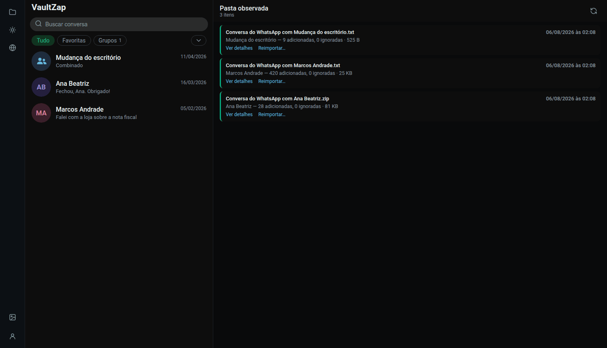
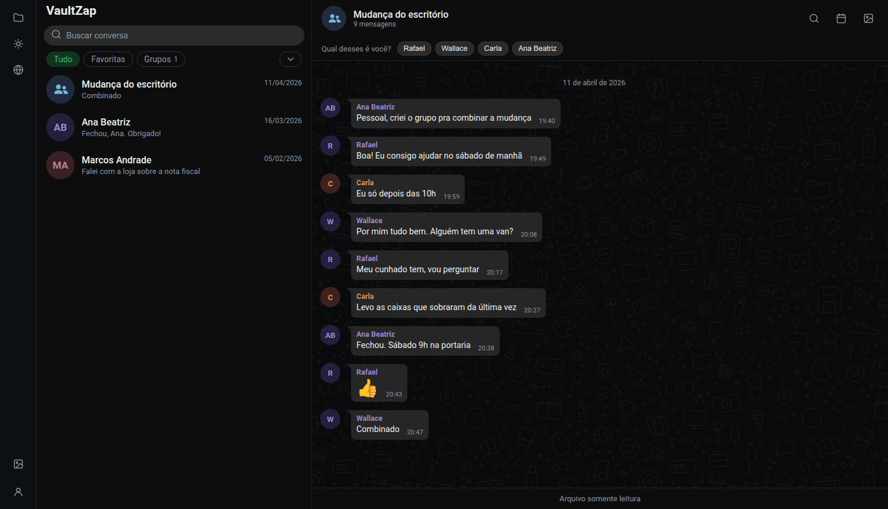
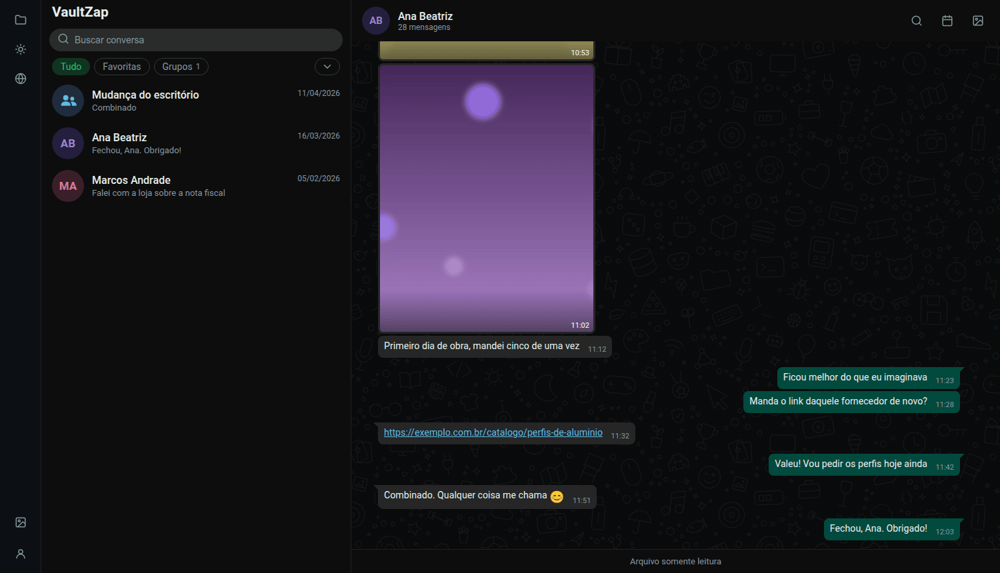
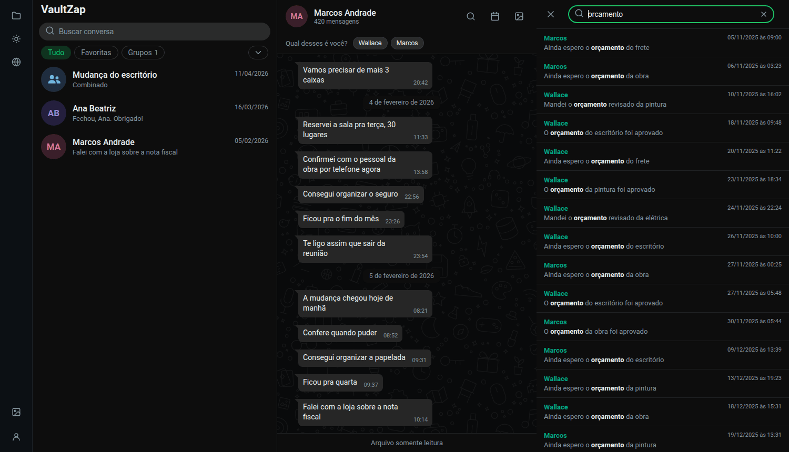
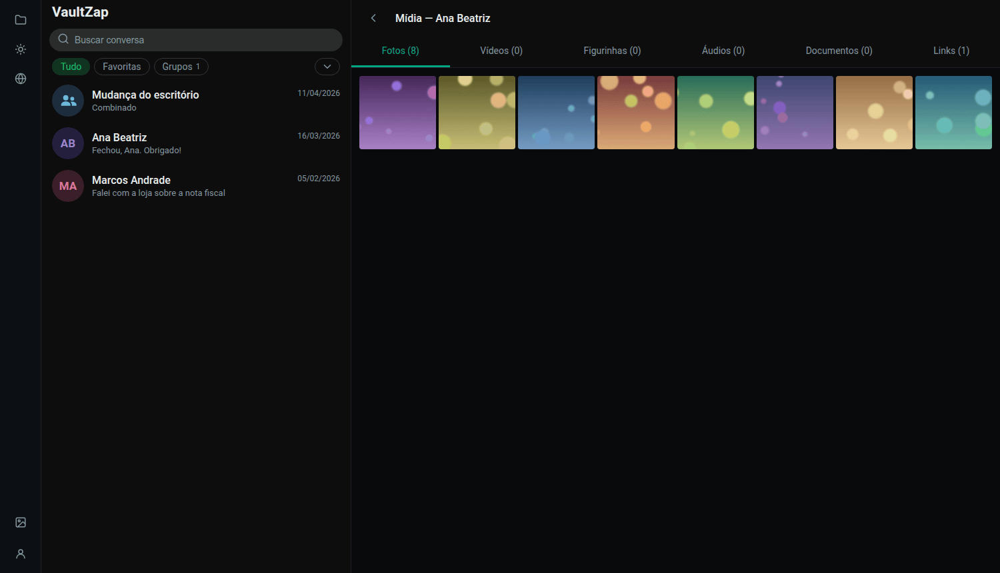
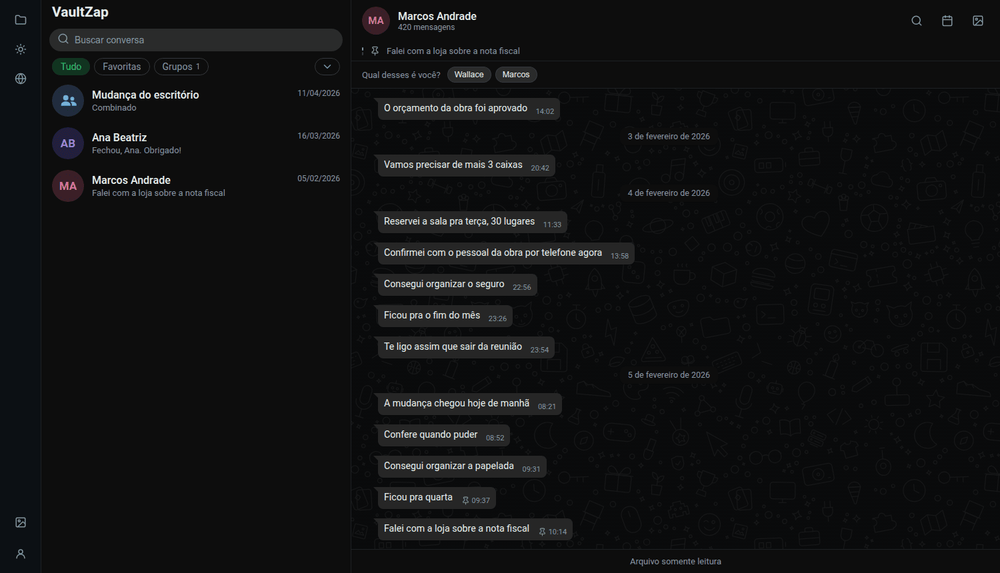
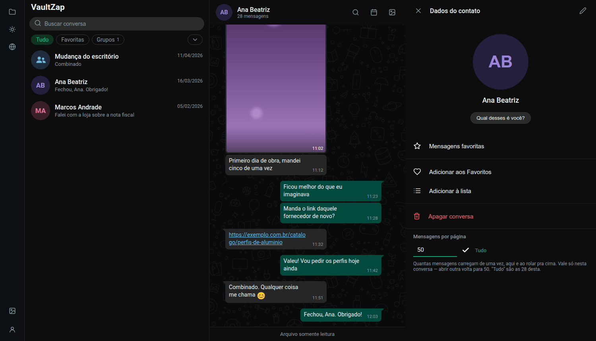
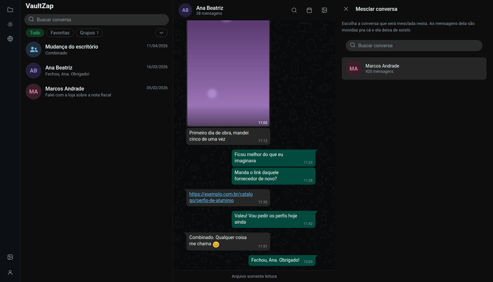

[← Voltar ao README](../README.md) · [Configuração](configuration.md) · [Desenvolvimento](development.md) · [Docker](docker.md) · [Podman](podman.md) · [Quadlet](quadlet.md) · [Uso](usage.md) · [Problemas](troubleshooting.md)

# Uso

O que dá para fazer depois que o app está no ar. Nada aqui é obrigatório: soltar o export na
inbox e abrir a conversa já é o fluxo completo — o resto existe para quando o acervo cresce.

**O VaultZap é somente leitura.** Não há campo de digitação: no lugar dele, uma barra
dizendo "Arquivo somente leitura". Ele não conecta na sua conta, não envia mensagem e não
conhece nenhuma API do WhatsApp.

## Importar uma conversa

Solte o `.txt` ou o `.zip` exportado na pasta observada (`VAULTZAP_INBOX`). São aceitos:

- `Conversa do WhatsApp com Fulano.txt` — conversa sem mídia;
- `Conversa do WhatsApp com Fulano.zip` — o export com mídia, do jeito que o WhatsApp gera;
- uma subpasta contendo o `.txt` e as mídias soltas (é também o layout do
  [chatvault](https://github.com/vitormarcal/chatvault), que é importado direto, com a foto
  de perfil junto).

**A varredura não é periódica.** Ela roda quando o app inicia e quando você clica em
**"varrer agora"** na página de importações (ícone de pasta na sidebar). É de propósito:
inotify não funciona em pasta de rede (CIFS/SMB, NFS), que é justamente o caso de quem
sincroniza a inbox com o celular via Syncthing ou Samba.

O botão leva alguns segundos e é normal: o app lê a pasta duas vezes, com um intervalo, para
não tocar num arquivo que ainda está sendo copiado. Um `.zip` de 800 MB no meio da cópia
seria um import quebrado.

Depois de importado, o arquivo **sai da inbox** e vai para `.imported/AAAA-MM/` (política
padrão `move` — nada é apagado, só muda de lugar). Assim a inbox mostra sempre só o que
falta importar. Para mudar isso, veja `VAULTZAP_AFTER_IMPORT` em
[Configuração](configuration.md).

### Reexportar a mesma conversa depois

É o caso comum: daqui a alguns meses você exporta a mesma conversa de novo e solta na pasta.
**Só as mensagens novas entram** — as repetidas são ignoradas, não duplicadas. Vale para
mídia também, deduplicada por conteúdo.

Se você exportou primeiro sem mídia e depois com mídia, importe os dois: as mensagens não
duplicam e as fotos aparecem nas que já estavam lá.

### A página de importações

O ícone de pasta na sidebar abre o histórico: cada arquivo visto, quantas mensagens entraram,
quantas foram ignoradas e os avisos do parser. Um ponto colorido aparece na sidebar quando há
erro ou arquivo em processamento.

  

- **"Ignoradas" não são mensagens perdidas** — são as que já estavam no acervo.
- **Avisos** dizem a linha exata do export que o parser não entendeu. Um arquivo corrompido
  nunca derruba a importação: a linha vira uma mensagem de sistema com o texto bruto, e o
  resto entra normalmente. Se quiser corrigir o `.txt` e reimportar, use **"Reimportar…"** no
  próprio item.

### Verificação de coerência

Cada arquivo importado passa por uma triagem: o VaultZap compara o que veio com o que o
WhatsApp costuma escrever e lista o que destoa, no mesmo painel de detalhes.

**Antes de tudo, o que ela não é.** Um export do WhatsApp não tem assinatura, MAC nem
qualquer amarração criptográfica com o aparelho — é texto puro, e um editor de texto altera
uma linha sem deixar vestígio. **Nenhum software consegue atestar que um export é autêntico**,
e este também não. Ausência de alertas não é prova de nada; o que a verificação pega é edição
descuidada.

O que ela olha:

| sinal | o que significa |
|---|---|
| **Marcas invisíveis** | o WhatsApp escreve caracteres invisíveis (`U+200E` e parentes) antes de linhas de anexo e de aviso. Quem edita no bloco de notas não os reproduz. Só vale quando o arquivo mostra que os usa: um export do Android não tem nenhum, e isso é normal. |
| **Ordem cronológica** | mensagem datada muito antes da anterior. Inversões de segundos são normais — o WhatsApp lista na ordem em que a conversa aparece, e mensagem que chega atrasada mantém o horário de origem —, então só contam diferenças acima de cinco minutos. |
| **Nome de mídia** | foto, vídeo, áudio e figurinha recebem nomes do próprio WhatsApp (`IMG-20260726-WA0001.jpg`). Documento e cartão de contato mantêm o nome original e não são checados. |
| **Data no nome da mídia** | o nome carrega o dia em que o arquivo foi criado. Diferente do dia da mensagem, é sinal de que um dos dois foi mexido. |
| **Mídia ausente** | arquivos citados no texto que não vieram no `.zip`, **enquanto outros vieram**. Export "sem mídia" cita tudo e não traz nada — isso é normal e não é apontado. |

Cada alerta diz a linha ou a mensagem onde começa, para você abrir o arquivo e olhar.

Duas coisas que ajudam mais que qualquer verificação automática:

- **O hash do arquivo já fica gravado.** O VaultZap guarda o `sha256` de tudo que importa, o
  que fixa os bytes a partir daquele momento: se o arquivo mudar depois, o hash denuncia.
- **Comparar com o export do outro lado.** A mesma conversa exportada do aparelho da outra
  pessoa é a verificação mais forte que existe sem perícia. Divergência entre os dois é
  alteração — ou apagamento — em um deles.

Se a conversa vai ser usada como prova, o caminho que vale é outro: ata notarial (o tabelião
registra o que vê no aparelho) ou perícia no dispositivo. Vale saber que a Meta não consegue
fornecer o conteúdo das mensagens nem por ordem judicial — elas são criptografadas ponta a
ponta; ela só tem metadados.

## Quem é "você"

Numa conversa 1:1 o app deduz sozinho: o nome do arquivo é a outra pessoa, então o outro
remetente é você — e suas mensagens vão para a direita, em verde. Quando não dá para deduzir
(grupo, arquivo renomeado, apelido diferente), aparece uma barra no topo da conversa
perguntando **"qual destes é você?"**. Sem responder, todas as bolhas ficam à esquerda; é
chute que o app não dá.

  

A escolha vale por conversa e pode ser refeita a qualquer momento no painel **Dados do
contato**. Para definir um padrão global, use `VAULTZAP_ME`.

## Ler a conversa

A leitura imita o WhatsApp Web de propósito: bolhas dos dois lados, mensagens consecutivas do
mesmo remetente agrupadas, divisores de data ("HOJE", "ONTEM", "sábado", "26 de julho de
2026"), mídia inline, figurinha sem bolha, áudio com player, documento como card.

  

Não há ✓✓: o export não traz status de entrega nem de leitura, e o VaultZap não inventa dado
que o arquivo não tem.

- A conversa abre no fim e **carrega 50 mensagens por vez** conforme você rola para cima.
- Para carregar mais de uma vez, use o campo **"Carregar mensagens"** no painel Dados do
  contato — ou o botão **"Tudo"**, que traz a conversa inteira. Numa conversa de 36 mil
  mensagens isso leva alguns segundos e vale o custo quando você quer usar o Ctrl+F do
  navegador. O valor vale só na conversa aberta; abrir outra volta para 50.
- **Um player por vez**: dar play num áudio ou vídeo pausa o que estava tocando.

## Encontrar uma mensagem

Três caminhos, todos levando ao mesmo lugar — a conversa posicionada na mensagem, com ela
destacada por uma faixa verde:

  

**Busca global** — o campo no topo da sidebar filtra a lista de conversas.

**Busca na conversa** — a lupa no cabeçalho abre o painel de busca daquela conversa.
Acentos são ignorados: `nao` acha "não", `voce` acha "você".

**Calendário** — o ícone de calendário abre um mês por vez, com a contagem de mensagens de
cada dia (verde mais forte = mais conversa) e a lista dos dias com mensagem. Clicar num dia salta
para a primeira mensagem dele. Os seletores de mês e ano pulam direto para um período
distante; meses vazios no meio continuam navegáveis, que é justamente o que o calendário
serve para mostrar.

## Galeria

O ícone de galeria abre a mídia da conversa em seis abas: **fotos**, **vídeos**,
**figurinhas**, **áudios**, **documentos** e **links** (esta última varre o texto das
mensagens, não os anexos). Clicar numa foto ou vídeo abre em tela cheia.

  

Anexo citado no `.txt` mas ausente do `.zip` — comum quando se exporta "sem mídia" —
aparece como um espaço reservado, nunca como erro.

## Organizar a lista de conversas

Passe o mouse sobre uma conversa e use o menu (⌄):

| ação | o que faz |
|---|---|
| **Fixar** | Prende no topo da lista. Máximo de **3**; a quarta é recusada com um aviso. |
| **Favoritar** | Alimenta o chip "Favoritas" no alto da lista. |
| **Arquivar** | Tira da lista principal e põe em "Arquivadas". |
| **Adicionar a uma lista** | Listas suas (Família, Trabalho…). Uma conversa pode estar em várias. |
| **Mesclar conversa** | Junta outra conversa nesta. Veja abaixo. |
| **Atualizar conversa** | Importa um arquivo da inbox *nesta* conversa. Veja abaixo. |
| **Exportar conversa** | Cinco formatos. Veja abaixo. |
| **Apagar conversa** | Veja abaixo. |

Os **chips** acima da lista (`Tudo`, `Favoritas`, `Grupos`, mais uma por lista, e `+` para
criar) filtram a lista; o que não couber na linha vai para o menu `⌄` ao lado.

Arquivar e favoritar são só estado de interface: nenhuma mensagem, anexo ou arquivo é tocado.
Apagar uma lista não apaga conversa nenhuma.

**"Não lidas" não existe** — o export não traz status de leitura, e o VaultZap não inventa.

## Marcar mensagens

Passe o mouse sobre uma mensagem: um `⌄` aparece no canto dela.

  

- **Favoritar** guarda a mensagem em **Mensagens favoritas**, no painel Dados do contato —
  a lista de tudo que você marcou, com salto para a mensagem no contexto.
- **Fixar** põe a mensagem numa faixa sob o cabeçalho da conversa. Máximo de **4**; ao fixar
  a quinta, o app pergunta antes de substituir a mais antiga. Clicar na faixa salta para a
  fixada e avança para a próxima, então cliques repetidos passeiam por todas.

Diferente do WhatsApp, fixar aqui **não expira** — não há escolha de 24h/7 dias/30 dias.

## Dados do contato

Clique no nome da conversa no cabeçalho. Esse painel concentra a personalização:

  

- **Renomear a conversa** e anotar um **telefone**. Quando o contato não estava salvo no
  celular que exportou, o WhatsApp nomeia o arquivo com o número — nesse caso o telefone já
  vem preenchido sozinho e só falta você pôr um nome de gente.
- **Foto de perfil**: escolha uma imagem e recorte no círculo, com zoom. É a **única** coisa
  que se envia para o VaultZap, e é personalização sua, não dado do export — o WhatsApp não
  exporta foto de perfil. Sem foto, o avatar é as iniciais numa cor derivada do nome.
- **Renomear participante** (em grupo): o export identifica muita gente por telefone ou
  "~apelido". Aqui você dá um nome de exibição, e a cor e as iniciais passam a sair dele. O
  dado original do export nunca é alterado; o nome vale só neste grupo.
- **Refazer "quem sou eu"**, **mensagens favoritas** e o **tamanho de página** também moram
  aqui.

## Conversa repetida ou incompleta

O app casa export com conversa pelo **nome do arquivo**. Se o contato mudou de número, se
você renomeou a conversa aqui, ou se o export veio do chatvault (pasta com UUID), o arquivo
novo vira uma segunda conversa em vez de completar a que existe. Dois remédios:

  

**Mesclar conversa** — abra o menu da conversa que deve **ficar** e escolha, pelo nome, qual
outra absorver. As mensagens repetidas não duplicam; a que fica herda o que só a outra tinha
(mídia, foto, telefone, o "eu"). Só junta conversas do mesmo tipo — grupo nunca casa com
individual. **É irreversível**, então o app pede confirmação nomeando as duas pontas.

**Atualizar conversa** — abre a inbox e importa o arquivo escolhido *nesta* conversa,
ignorando o nome dele. É o caminho preventivo: solte o arquivo na pasta com o app aberto e
use o menu, em vez de deixar a varredura criar a conversa separada.

## Exportar de volta

Menu da conversa → **Exportar conversa**, em cinco formatos:

| formato | para que serve |
|---|---|
| **TXT** | Texto puro, próximo do export original do WhatsApp. |
| **Markdown** | Para versionar, colar num editor ou processar depois. |
| **HTML** | Página única com as bolhas dos dois lados, aberta em qualquer navegador. |
| **Impressão** | O mesmo, com folha de estilo de papel — abra e use "Salvar como PDF" no navegador. |
| **Typst** | Fonte `.typ` para quem quer tipografia de verdade e tem o compilador. Sai numa página contínua, sem quebras. |

**O VaultZap não gera PDF** e não invoca compilador nenhum: é o seu navegador (ou o seu
Typst) que fecha o arquivo. Sem binário externo, sem serviço.

**A mídia não vai no documento**: uma mensagem com anexo aparece como `[foto]`, `[áudio]`,
etc. Os arquivos continuam só dentro do VaultZap.

**O documento sai no idioma que estiver selecionado** na interface: divisores de data,
formato de data e hora, os rótulos de anexo e o rodapé. O texto das mensagens, esse nunca é
traduzido — é o que a pessoa escreveu.

## Apagar uma conversa

Menu da conversa → **Apagar**. Remove as mensagens, os anexos e **os arquivos de mídia dela
do disco**. O que não é tocado é o export original: se ele ainda estiver na inbox ou em
`.imported/`, é dele que a conversa volta — basta soltá-lo na inbox de novo e varrer.

## Idioma e tema

Na sidebar, o ícone de globo troca o idioma da interface inteira e o de sol/lua alterna claro
e escuro. Há oito idiomas: português (Brasil), português, inglês, espanhol, italiano,
francês, alemão e holandês. Além do texto, o idioma muda o formato de data, o relógio de
12h/24h e os nomes de mês e dia. Sem escolha sua, o app segue o idioma do navegador.

O **corpo das mensagens nunca é traduzido** — é o que a pessoa escreveu.

## Backup

O acervo inteiro é a pasta que você montou em `/data`: o `vaultzap.db` e a pasta `media/`.
Copiar essa pasta é o backup completo; um `rsync`/`borg` dela, com o container parado,
basta. Restaurar é o contrário: pôr a pasta de volta no lugar e subir o container.

Guarde também os exports originais (`.imported/`): são a única cópia que não depende deste
programa. E o `.db` é SQLite comum — `sqlite3 vaultzap.db` abre e lê tudo, hoje ou daqui a
dez anos, com ou sem o VaultZap.
